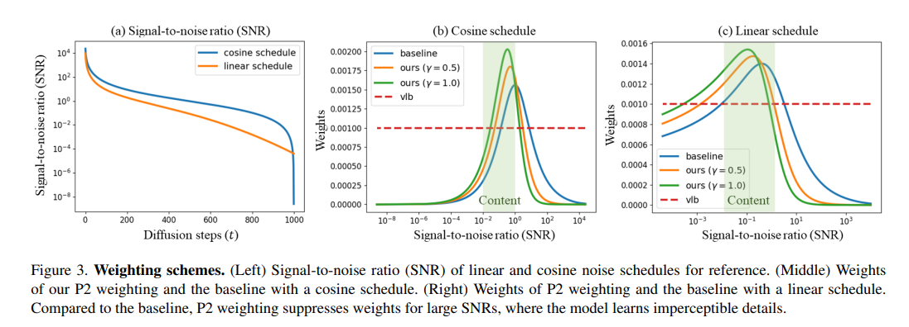

## Perception Prioritized Training of Diffusion Models CVPR (2022)
https://arxiv.org/abs/2204.00227

Summary
Emphasize training on the content stage to encourage the model to learn perceptually rich contexts.

### Figures

#### Weighting schemes

#### key words

### Comments
--------------------------------------------------------------------------------------

--------------------------------------------------------------------------------------
--------------------------------------------------------------------------------------
--------------------------------------------------------------------------------------
--------------------------------------------------------------------------------------
